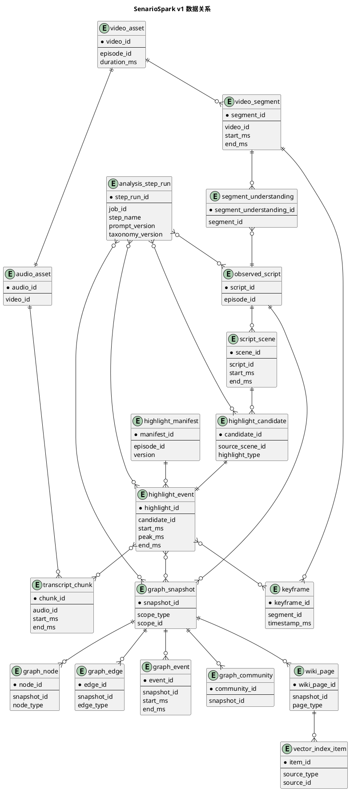

# 核心分析架构与数据结构 v1

本文档定义 SenarioSpark 视频分析链路的 v1 架构与核心数据结构。

这套结构的目标不是完整保存每一次模型返回的自然语言，而是保留足够清晰的结构化证据，让每一段剧本、每一个高光点都能反查到原始视频时间轴。

v1 定型范围：

```text
1. 视频理解、高光识别、证据反查属于同一个 AI Understanding Service。
2. 主链路采用确定性 Analysis Workflow，不做全流程大 Agent。
3. 高光识别和时间反查由同一个受控 Highlight Extraction Agent 完成。
4. llm-wiki 风格图谱构建不拆新服务，作为同一服务内的低频增强 pipeline。
5. 前端具体特效不写入高光结构，由 interaction_strategy 动态映射。
```

## 处理链路

```text
video_url
  -> video_asset
  -> audio_asset
  -> transcript_chunks
  -> video_segments + keyframes
  -> segment_understandings
  -> understanding_package
  -> observed_script
  -> Highlight Extraction Agent
      -> highlight_candidates
      -> evidence backtrace
      -> highlight_events
  -> stored records + frontend manifest

低频增强链路：

observed_script + highlight_events + segment_understandings
  -> knowledge_graph pipeline
  -> graph_snapshot + wiki_pages
  -> vector_index
```

## 生产分析形态

AI 分析服务在生产上不应该做成一个“全流程大 Agent”。主链路应该是确定性工作流，负责调度、重试、限流、状态恢复和成本控制。

推荐形态：

```text
AI Understanding Service
  -> 视频下载 / 入库
  -> 音频提取
  -> 音频拆块 ASR
  -> 视频切段 / 抽关键帧
  -> 片段多模态理解
  -> 剧本生成
  -> Highlight Extraction Agent
  -> 结构化存储
  -> 人工审核 / manifest 生成
  -> 知识图谱构建
  -> 向量索引同步
```

其中 `Highlight Extraction Agent` 是唯一的受控 Agent，负责从观测剧本中识别高光，并主动调用工具反查原始证据，最后输出可入库的精准 `highlight_events`。

它内部可以分为两个阶段，但实现上仍是同一个 Agent：

```text
阶段 1：从 observed_script 中识别 highlight_candidates
阶段 2：基于 candidate 调用工具读取 scene / segment / ASR / keyframe，定位 start_ms / peak_ms / end_ms
```

这样可以保证“为什么这是高光”和“为什么这个时间点触发”属于同一段上下文推理，避免拆成两个 Agent 后出现语义断裂。

### Agent 受控边界

`Highlight Extraction Agent` 必须满足以下约束：

```text
固定输入：observed_script + understanding_package + taxonomy
固定工具：只能读取剧本、片段、ASR、关键帧和邻近上下文
固定输出：只能提交符合 schema 的 highlight_events
固定枚举：highlight_type / audience_emotion / interaction_intent 必须来自 taxonomy
固定轮次：限制最大工具调用次数，防止成本失控
固定审计：记录 prompt_version、taxonomy_version、tool_calls、model_request_id
```

Agent 不允许直接写数据库。它只能通过 `submit_highlight_events` 工具提交结构化结果，由工作流做 schema 校验、枚举校验、幂等写入和状态推进。

### Agent 注入的 taxonomy

每次运行时，工作流都要把当前枚举版本注入给 Agent：

```json
{
  "taxonomy_version": "highlight_taxonomy_v0.1",
  "highlight_type_enum": [
    "conflict",
    "reversal",
    "face_slap",
    "villain_pressure",
    "identity_reveal",
    "revenge_counterattack",
    "sweet_moment",
    "confession",
    "rescue",
    "betrayal",
    "misunderstanding",
    "tearjerker",
    "cliffhanger",
    "comic_relief"
  ],
  "audience_emotion_enum": [
    "anger",
    "disgust",
    "shock",
    "satisfaction",
    "anticipation",
    "sympathy",
    "sadness",
    "anxiety",
    "sweetness",
    "delight",
    "amusement",
    "admiration",
    "curiosity",
    "relief"
  ],
  "interaction_intent_enum": [
    "vent",
    "celebrate",
    "support",
    "comfort",
    "ship",
    "tease",
    "applaud",
    "predict",
    "question"
  ]
}
```

### Agent 工具

MVP 阶段只开放这些工具：

```text
get_scene(scene_id)
get_segment(segment_id)
get_asr_segments(segment_id 或 time_range)
get_neighbor_segments(segment_id, before, after)
get_keyframes(segment_id)
submit_highlight_events(events)
```

工具返回值必须带 `source_id` 和时间轴字段，方便 Agent 输出可审计证据。

### 服务内部 pipeline 划分

v1 不拆分新的 AI 微服务。`understanding-service` 内部按任务类型组织 pipeline：

```text
ai-services/
  understanding-service/
    pipelines/
      video_analysis/          视频、音频、ASR、关键帧、片段理解
      script_generation/       观测剧本生成
      highlight_extraction/    高光识别 + 证据反查 Agent
      knowledge_graph/         llm-wiki 风格图谱构建
      vector_index/            剧情知识库向量索引
```

运行时任务类型：

```text
analyze_video              高频，视频接入后触发
generate_script            高频，视频理解完成后触发
extract_highlights         高频，剧本生成后触发
build_knowledge_graph      低频，内容定稿或人工审核后触发
sync_vector_index          低频，图谱或剧本更新后触发
```

拆分原则：

```text
同一个服务内解耦 pipeline，不拆部署单元。
图谱和向量索引是离线增强能力，一次生成，多次查询，多次分发。
```

## 通用规则

- 所有时间字段统一使用毫秒：`start_ms`、`end_ms`、`peak_ms`、`timestamp_ms`。
- 所有 AI 生成结构都必须保留来源引用，例如 `source_video_id`、`source_segment_ids`、`transcript_chunk_ids`、`evidence`。
- 面向 AI 和策略匹配的语义字段使用受控枚举，不使用自由发挥的中文标签。
- 每条高光都保留 `taxonomy_version`，方便后续枚举体系版本化演进。
- 高光记录不存具体前端特效。高光只描述语义和互动意图，具体特效由交互策略层动态映射。

## Taxonomy v0.1

### `highlight_type`

表示剧情高光类型。

```text
conflict               冲突
reversal               反转
face_slap              打脸
villain_pressure       反派压迫
identity_reveal        身份揭露
revenge_counterattack  反击复仇
sweet_moment           甜蜜撒糖
confession             表白
rescue                 救场
betrayal               背叛
misunderstanding       误会
tearjerker             虐心
cliffhanger            悬念钩子
comic_relief           搞笑缓和
```

### `audience_emotion`

表示观众看到该高光后最可能被触发的情绪。

```text
anger          愤怒
disgust        厌恶
shock          震惊
satisfaction   爽感
anticipation   期待
sympathy       心疼
sadness        难过
anxiety        紧张
sweetness      甜
delight        开心
amusement      好笑
admiration     佩服
curiosity      好奇
relief         松一口气
```

### `interaction_intent`

表示产品希望激发的互动意图。

```text
vent           宣泄
celebrate      庆祝
support        支持角色
comfort        安慰
ship           嗑糖
tease          吐槽调侃
applaud        喝彩
predict        猜后续
question       提问讨论
```

### `sentiment_polarity`

表示情绪整体倾向。

```text
positive       正向
negative       负向
mixed          混合
neutral        中性
```

## 数据结构

### `analysis_job`

表示一次视频分析任务。

```json
{
  "job_id": "job_20260521_0001",
  "episode_id": "ep_003",
  "video_id": "vid_003",
  "status": "completed",
  "pipeline_version": "analysis_pipeline_v0.1",
  "taxonomy_version": "highlight_taxonomy_v0.1",
  "created_at": "2026-05-21T20:55:00+08:00",
  "completed_at": "2026-05-21T20:59:30+08:00",
  "error": null
}
```

核心字段：

```text
job_id              分析任务 ID
episode_id          集数 ID
video_id            视频 ID
status              pending / processing / completed / failed
pipeline_version    分析链路版本
taxonomy_version    高光语义枚举版本
error               失败信息，成功时为空
```

### `analysis_step_run`

表示分析工作流中某一个步骤的执行记录。生产环境必须记录它，方便失败重试、成本分析和问题定位。

```json
{
  "step_run_id": "step_ep_003_highlight_agent_001",
  "job_id": "job_20260521_0001",
  "episode_id": "ep_003",
  "step_name": "highlight_extraction_agent",
  "status": "completed",
  "input_artifact_ids": ["script_ep_003_v1", "upkg_ep_003_v1"],
  "output_artifact_ids": ["hl_002", "hl_003", "hl_004"],
  "model_provider": "deepseek",
  "model_name": "deepseek-v4-pro",
  "prompt_version": "highlight_agent_prompt_v0.1",
  "schema_version": "highlight_event_schema_v0.1",
  "taxonomy_version": "highlight_taxonomy_v0.1",
  "tool_call_count": 34,
  "latency_ms": 42800,
  "error": null
}
```

核心字段：

```text
step_name              工作流步骤名
input_artifact_ids     本步骤读取了哪些上游产物
output_artifact_ids    本步骤生成了哪些下游产物
prompt_version         提示词版本
schema_version         输出结构版本
taxonomy_version       枚举版本
tool_call_count        工具调用次数
latency_ms             执行耗时
```

### `video_asset`

表示原始视频输入。

```json
{
  "video_id": "vid_003",
  "episode_id": "ep_003",
  "source_url": "file:///C:/Users/23999/Downloads/第3集.mp4",
  "storage_uri": "s3://senario-spark/videos/ep_003.mp4",
  "duration_ms": 183250,
  "width": 1080,
  "height": 1920,
  "fps": 50,
  "codec": "h264",
  "checksum": "sha256:...",
  "status": "ready"
}
```

核心字段：

```text
video_id        视频 ID
episode_id      所属集数
source_url      原始输入地址
storage_uri     入库后的对象存储地址
duration_ms     视频时长
width/height    视频尺寸
fps             帧率
codec           视频编码
checksum        内容校验值，用于去重和幂等
status          ready / processing / failed
```

### `audio_asset`

表示从视频中提取出的音频。

```json
{
  "audio_id": "audio_ep_003",
  "video_id": "vid_003",
  "episode_id": "ep_003",
  "storage_uri": "s3://senario-spark/audio/ep_003.wav",
  "sample_rate": 16000,
  "channels": 1,
  "duration_ms": 183250
}
```

### `transcript_chunk`

表示一个音频块及其 ASR 结果。

```json
{
  "chunk_id": "aud_005",
  "audio_id": "audio_ep_003",
  "episode_id": "ep_003",
  "start_ms": 100000,
  "end_ms": 120000,
  "text": "没事啊爹娘慢走沈慧珍演了十五年的刺，也真是难为你们了。",
  "provider": "zhipu_glm_asr",
  "model": "glm-asr",
  "asr_segments": [
    {
      "asr_id": 1,
      "start_ms": 103200,
      "end_ms": 104400,
      "text": "爹娘慢走"
    },
    {
      "asr_id": 2,
      "start_ms": 106800,
      "end_ms": 107600,
      "text": "沈慧珍"
    },
    {
      "asr_id": 3,
      "start_ms": 107800,
      "end_ms": 110900,
      "text": "演了十五年的刺，也真是难为你们了。"
    }
  ]
}
```

说明：

```text
chunk_id          音频块 ID
start_ms/end_ms   音频块在原视频中的时间范围
text              该块整体 ASR 文本
asr_segments      更细粒度的 ASR 句段，后续用于反查高光时间点
```

### `video_segment`

表示一个视频时间片段。MVP 阶段可以先使用固定窗口，例如每 8 秒一个 segment。

```json
{
  "segment_id": "seg_013",
  "video_id": "vid_003",
  "episode_id": "ep_003",
  "start_ms": 104000,
  "end_ms": 112000,
  "keyframe_ids": ["kf_seg_013_108000"]
}
```

### `keyframe`

表示从视频片段中抽取出的关键帧。

```json
{
  "keyframe_id": "kf_seg_013_108000",
  "segment_id": "seg_013",
  "episode_id": "ep_003",
  "timestamp_ms": 108000,
  "image_uri": "s3://senario-spark/keyframes/ep_003/seg_013_108000.jpg"
}
```

### `segment_understanding`

表示单个视频片段的多模态理解结果。它由该片段的时间范围、附近 ASR 文本和关键帧共同生成。

```json
{
  "segment_understanding_id": "su_seg_013",
  "segment_id": "seg_013",
  "episode_id": "ep_003",
  "start_ms": 104000,
  "end_ms": 112000,
  "keyframe_ids": ["kf_seg_013_108000"],
  "transcript_refs": ["aud_005:1", "aud_005:2", "aud_005:3"],
  "dialogue_raw": "爹娘慢走 沈慧珍 演了十五年的刺，也真是难为你们了。",
  "visual_summary": "一名身着白色绣花古装、头戴发冠的年轻男子侧目凝视，神情复杂，背景为模糊的古风庭院与红叶。",
  "scene": "室外庭院，光线柔和，氛围凝重，似为送别或对峙场景。",
  "main_actions": "男子侧身站立，目光斜视，似乎在注视或回应画面外的人物，表情从平静转为隐忍或讽刺。",
  "emotion_hint": "冷漠、讽刺、压抑、看透真相后的疏离感。",
  "conflict_level": 4
}
```

注意：这里的 `emotion_hint` 是片段内容理解辅助信息，不等于最终的观众情绪。

### `understanding_package`

表示一个完整集数的分析证据包，是后续剧本生成和高光分析的统一输入。

```json
{
  "package_id": "upkg_ep_003_v1",
  "episode_id": "ep_003",
  "video_id": "vid_003",
  "pipeline_version": "analysis_pipeline_v0.1",
  "video_asset_id": "vid_003",
  "audio_asset_id": "audio_ep_003",
  "transcript_chunk_ids": ["aud_000", "aud_001", "aud_002", "aud_003", "aud_004", "aud_005"],
  "video_segment_ids": ["seg_000", "seg_001", "seg_002", "seg_013"],
  "segment_understanding_ids": ["su_seg_000", "su_seg_001", "su_seg_002", "su_seg_013"]
}
```

### `observed_script`

表示从视频理解结果中生成的“观测剧本”。它不是原始剧本，而是模型根据视频、ASR、关键帧推断出的结构化剧本。

```json
{
  "script_id": "script_ep_003_v1",
  "episode_id": "ep_003",
  "title": "镇北侯府·孽障",
  "summary": "镇北侯府内，父亲因次子雨儿文不成武不就、欠下巨额债务而震怒。雨儿冷漠旁观，暗讽母亲沈慧珍伪装慈母十五年。",
  "characters": [
    {
      "character_id": "char_shen_huizhen",
      "name": "沈慧珍",
      "aliases": ["母亲"],
      "description": "侯府夫人，表面慈爱，实则心机深沉。"
    },
    {
      "character_id": "char_yuer",
      "name": "雨儿",
      "aliases": [],
      "description": "次子，被父亲称为孽障，性格顽劣但疑似早已看穿真相。"
    }
  ],
  "scenes": [
    {
      "scene_id": "scene_05",
      "start_ms": 96000,
      "end_ms": 112000,
      "location": "古代庭院/室外送别场景",
      "summary": "父母离开后，雨儿冷漠地讽刺母亲沈慧珍演了十五年的慈母。",
      "characters": ["雨儿", "母亲", "父亲"],
      "source_segment_ids": ["seg_012", "seg_013"],
      "beats": [
        {
          "beat_id": "beat_scene_05_001",
          "type": "action",
          "speaker": "母亲",
          "content": "女子双手轻扶父亲手臂，神情关切地仰视对方，似在送别。",
          "character_emotion": "温情、不舍",
          "source_segment_ids": ["seg_012"]
        },
        {
          "beat_id": "beat_scene_05_002",
          "type": "dialogue",
          "speaker": "雨儿",
          "content": "爹娘慢走。沈慧珍，演了十五年的慈母，也真是难为你们了。",
          "character_emotion": "冷漠、讽刺、疏离",
          "source_segment_ids": ["seg_013"]
        }
      ]
    }
  ]
}
```

同时生成 `observed_script.md`，用于内容工作台人工审核。自动反查时间点时，应使用 JSON 里的结构化引用和原始证据，不依赖 Markdown。

### `highlight_candidate`

表示 `Highlight Extraction Agent` 从观测剧本中分析出的高光候选。它是 Agent 内部阶段产物，已经有语义判断，但还不一定拥有足够精确的时间点。

生产上可以选择持久化该结构用于调试和审核解释；但真正进入业务审核和前端分发链路的是最终的 `highlight_event`。

```json
{
  "candidate_id": "hc_ep_003_002",
  "episode_id": "ep_003",
  "taxonomy_version": "highlight_taxonomy_v0.1",
  "source_scene_id": "scene_05",
  "source_segment_ids": ["seg_012", "seg_013"],
  "highlight_type": "reversal",
  "secondary_highlight_types": ["face_slap"],
  "summary": "父母温情送别离开后，雨儿瞬间变脸，冷漠讽刺继母沈慧珍演了十五年的慈母。",
  "trigger_text_clean": "沈慧珍，演了十五年的慈母，也真是难为你们了。",
  "primary_audience_emotion": "shock",
  "audience_emotions": ["shock", "satisfaction", "anticipation"],
  "interaction_intent": "tease",
  "sentiment_polarity": "mixed",
  "intensity": 0.9,
  "confidence": 0.82
}
```

字段说明：

```text
highlight_type              主高光类型，必须来自受控枚举
secondary_highlight_types    辅助高光类型，可为空
trigger_text_clean           剧本清洗后的触发语句
primary_audience_emotion     最主要观众情绪
audience_emotions            观众情绪列表，建议 1-3 个
interaction_intent           互动意图，供策略层匹配特效
intensity                    高光强度，0-1
confidence                   模型置信度，0-1
```

### `highlight_event`

表示 `Highlight Extraction Agent` 经过证据反查后提交的完整高光事件。这是进入内容工作台审核和数据库存储的核心结构。

```json
{
  "highlight_id": "hl_002",
  "candidate_id": "hc_ep_003_002",
  "episode_id": "ep_003",
  "taxonomy_version": "highlight_taxonomy_v0.1",
  "source_scene_id": "scene_05",
  "source_segment_ids": ["seg_012", "seg_013"],
  "highlight_type": "reversal",
  "secondary_highlight_types": ["face_slap"],
  "summary": "父母温情送别离开后，雨儿瞬间变脸，冷漠讽刺继母沈慧珍演了十五年的慈母。",
  "trigger_text_clean": "沈慧珍，演了十五年的慈母，也真是难为你们了。",
  "trigger_text_raw": "沈慧珍 演了十五年的刺，也真是难为你们了。",
  "primary_audience_emotion": "shock",
  "audience_emotions": ["shock", "satisfaction", "anticipation"],
  "interaction_intent": "tease",
  "sentiment_polarity": "mixed",
  "intensity": 0.9,
  "confidence": 0.82,
  "timing": {
    "start_ms": 106800,
    "peak_ms": 108350,
    "end_ms": 110900
  },
  "evidence": [
    {
      "type": "visual",
      "segment_id": "seg_013",
      "keyframe_id": "kf_seg_013_108000",
      "description": "年轻男子侧目凝视，神情从平静转为隐忍讽刺，背景为红叶庭院。"
    },
    {
      "type": "asr",
      "segment_id": "seg_013",
      "transcript_chunk_id": "aud_005",
      "asr_id": 2,
      "text": "沈慧珍",
      "start_ms": 106800,
      "end_ms": 107600
    },
    {
      "type": "asr",
      "segment_id": "seg_013",
      "transcript_chunk_id": "aud_005",
      "asr_id": 3,
      "text": "演了十五年的刺，也真是难为你们了。",
      "start_ms": 107800,
      "end_ms": 110900
    },
    {
      "type": "context",
      "segment_id": "seg_012",
      "description": "紧接父母送别的温情场景，形成强烈反差。"
    }
  ],
  "review_status": "pending",
  "enabled": false
}
```

这里要特别注意：

```text
trigger_text_clean    面向产品展示和剧本阅读
trigger_text_raw      面向证据回溯和时间定位
timing                面向播放器触发
evidence              面向审核、纠错和可解释性
```

### `highlight_review`

表示内容工作台中的审核状态。

```json
{
  "review_id": "review_hl_002_001",
  "highlight_id": "hl_002",
  "episode_id": "ep_003",
  "review_status": "approved",
  "enabled": true,
  "reviewer_id": "operator_001",
  "reviewed_at": "2026-05-21T21:20:00+08:00",
  "notes": "时间点准确，适合上线。"
}
```

建议状态：

```text
pending       待审核
approved      已通过
rejected      已拒绝
needs_edit    需要修改
```

### `highlight_manifest`

表示下发给前端播放器的轻量级高光清单。它只包含播放时机和语义字段，不包含完整证据链。

```json
{
  "manifest_id": "manifest_ep_003_v1",
  "episode_id": "ep_003",
  "version": 1,
  "taxonomy_version": "highlight_taxonomy_v0.1",
  "generated_at": "2026-05-21T21:22:00+08:00",
  "strategy_id": "default_cn_v1",
  "items": [
    {
      "highlight_id": "hl_002",
      "highlight_type": "reversal",
      "secondary_highlight_types": ["face_slap"],
      "audience_emotions": ["shock", "satisfaction", "anticipation"],
      "interaction_intent": "tease",
      "sentiment_polarity": "mixed",
      "intensity": 0.9,
      "timing": {
        "start_ms": 106800,
        "peak_ms": 108350,
        "end_ms": 110900
      },
      "render_hints": {
        "density": "high",
        "urgency": "instant",
        "screen_position": "center"
      }
    }
  ]
}
```

前端不应该根据 `highlight_type` 直接写死特效，而应该结合 `strategy_id` 对应的策略配置做动态映射。

### `interaction_strategy`

表示运行时的交互策略。它负责把高光语义映射成具体前端特效。该配置可以因节日、实验分组、用户分层、设备性能而变化。

```json
{
  "strategy_id": "default_cn_v1",
  "status": "active",
  "rules": [
    {
      "rule_id": "rule_reversal_tease_high",
      "priority": 100,
      "match": {
        "highlight_type": ["reversal", "face_slap"],
        "interaction_intent": ["tease", "applaud"],
        "min_intensity": 0.75
      },
      "effect_pool": [
        {
          "effect_id": "shock_wave",
          "weight": 60
        },
        {
          "effect_id": "applause_burst",
          "weight": 40
        }
      ]
    }
  ],
  "fallback_effect_id": "quick_react_bubble"
}
```

这样同一条高光可以在不同策略下映射成不同效果：

```text
普通策略       -> shock_wave
节日策略       -> festival_firework
A/B 实验 A     -> applause_burst
A/B 实验 B     -> quick_react_bubble
低端设备       -> simple_toast_reaction
```

### `graph_snapshot`

表示某一集或某个短剧系列的一次图谱构建版本。图谱不是高频在线生成内容，而是内容分析完成后的离线增强产物。

```json
{
  "snapshot_id": "graph_ep_003_v1",
  "scope_type": "episode",
  "scope_id": "ep_003",
  "source_script_id": "script_ep_003_v1",
  "source_highlight_ids": ["hl_001", "hl_002", "hl_003"],
  "pipeline_version": "knowledge_graph_pipeline_v0.1",
  "status": "completed",
  "created_at": "2026-05-21T21:30:00+08:00"
}
```

核心字段：

```text
snapshot_id             图谱快照 ID
scope_type              episode / series
scope_id                集数 ID 或系列 ID
source_script_id        来源观测剧本
source_highlight_ids    参与构建的高光事件
pipeline_version        图谱构建 pipeline 版本
```

### `graph_node`

表示图谱中的节点。MVP 阶段先覆盖角色、地点、事件、组织、物品和主题。

```json
{
  "node_id": "node_char_shen_huizhen",
  "snapshot_id": "graph_ep_003_v1",
  "node_type": "character",
  "name": "沈慧珍",
  "aliases": ["母亲", "侯府夫人"],
  "summary": "侯府夫人，表面慈爱，实则故意养废继子以保亲子继承权。",
  "source_scene_ids": ["scene_05", "scene_07"],
  "source_segment_ids": ["seg_013", "seg_017", "seg_019"],
  "confidence": 0.86
}
```

建议节点类型：

```text
character       角色
location        地点
event           剧情事件
organization    组织 / 家族 / 阵营
object          关键物品
theme           主题 / 剧情线
```

### `graph_edge`

表示节点之间的关系。

```json
{
  "edge_id": "edge_yuer_exposes_shen_huizhen",
  "snapshot_id": "graph_ep_003_v1",
  "source_node_id": "node_char_yuer",
  "target_node_id": "node_char_shen_huizhen",
  "edge_type": "exposes",
  "summary": "雨儿当面讽刺沈慧珍演了十五年的慈母，暗示自己已经看穿她的伪装。",
  "source_scene_ids": ["scene_05"],
  "source_highlight_ids": ["hl_002"],
  "confidence": 0.84
}
```

建议关系类型：

```text
family          亲属 / 家族关系
opposes         对立
protects        保护
deceives        欺骗
exposes         揭穿
controls        控制
causes          因果
depends_on      前置依赖
belongs_to      归属
```

### `graph_event`

表示图谱中的剧情事件，强调时间线和因果关系。

```json
{
  "event_id": "gevent_ep_003_005",
  "snapshot_id": "graph_ep_003_v1",
  "title": "雨儿揭穿沈慧珍慈母伪装",
  "summary": "父母离开后，雨儿冷漠讽刺沈慧珍演了十五年的慈母，表明他早已看穿继母。",
  "start_ms": 106800,
  "end_ms": 110900,
  "participants": ["node_char_yuer", "node_char_shen_huizhen"],
  "source_scene_id": "scene_05",
  "source_highlight_id": "hl_002",
  "event_type": "revelation"
}
```

### `graph_community`

表示 llm-wiki 风格的图谱社区，也就是把一组高度相关的节点和关系聚合成一个可读主题。

```json
{
  "community_id": "community_shen_huizhen_scheme",
  "snapshot_id": "graph_ep_003_v1",
  "title": "沈慧珍的慈母伪装与继承权阴谋",
  "summary": "该社区围绕沈慧珍、雨儿、羽儿和继承权展开，核心冲突是表面慈母形象与暗中操控继子命运之间的反差。",
  "node_ids": ["node_char_shen_huizhen", "node_char_yuer", "node_char_yuer_child"],
  "edge_ids": ["edge_yuer_exposes_shen_huizhen"],
  "source_scene_ids": ["scene_05", "scene_07"]
}
```

### `wiki_page`

表示基于图谱生成的可读知识页。它可以服务内容工作台、AI 问答、前情提要和剧情解释。

```json
{
  "wiki_page_id": "wiki_char_shen_huizhen_v1",
  "snapshot_id": "graph_ep_003_v1",
  "page_type": "character",
  "title": "沈慧珍",
  "summary": "沈慧珍是侯府夫人，表面上照顾继子，实际为了保住亲子继承权而长期布局。",
  "sections": [
    {
      "heading": "人物身份",
      "content": "侯府夫人，雨儿名义上的母亲。"
    },
    {
      "heading": "关键行为",
      "content": "她被雨儿讽刺为演了十五年的慈母，并在后续回忆中暴露出操控继承权的动机。"
    }
  ],
  "source_node_ids": ["node_char_shen_huizhen"],
  "source_scene_ids": ["scene_05", "scene_07"]
}
```

### `vector_index_item`

表示进入向量库的知识条目。向量库不是原始事实源，只是检索加速层，事实源仍然是剧本、图谱和证据链。

```json
{
  "item_id": "vec_wiki_char_shen_huizhen_v1",
  "source_type": "wiki_page",
  "source_id": "wiki_char_shen_huizhen_v1",
  "episode_id": "ep_003",
  "series_id": "series_001",
  "text": "沈慧珍是侯府夫人，表面慈爱，实则为了保住亲子继承权长期布局。",
  "metadata": {
    "character": "沈慧珍",
    "page_type": "character",
    "snapshot_id": "graph_ep_003_v1"
  }
}
```

## 数据关系



## 存储拆分

MVP 阶段建议使用最简单但可追溯的拆分方式。

```text
对象存储：
  video_asset 原始视频
  audio_asset 提取音频
  keyframe 图片文件
  可选的图谱导出文件
  可选的 wiki 页面导出文件

关系型数据库：
  analysis_job
  analysis_step_runs
  video_asset 元数据
  audio_asset 元数据
  transcript_chunks
  video_segments
  keyframes
  segment_understandings
  observed_scripts
  highlight_candidates
  highlight_events
  highlight_reviews
  highlight_manifests
  interaction_strategies
  graph_snapshots
  graph_nodes
  graph_edges
  graph_events
  graph_communities
  wiki_pages

缓存 / 分发：
  每集最新启用的 highlight_manifest
  常用 wiki_page 摘要

向量库：
  vector_index_items 对应的文本向量
```

大块中间结果可以在 MVP 阶段先用 JSONB 存。后续如果查询压力增加，再拆成更细的表。

## 真实片段示例

当前 demo 视频为 `第3集.mp4`，视频总时长 `183250ms`。其中一个真实高光位于 `106800ms` 到 `110900ms`。

ASR 原始结果是：

```text
沈慧珍
演了十五年的刺，也真是难为你们了。
```

剧本清洗后修正为：

```text
沈慧珍，演了十五年的慈母，也真是难为你们了。
```

高光反查结果同时保留了清洗文本和原始证据：

```json
{
  "trigger_text_clean": "沈慧珍，演了十五年的慈母，也真是难为你们了。",
  "trigger_text_raw": "沈慧珍 演了十五年的刺，也真是难为你们了。",
  "timing": {
    "start_ms": 106800,
    "peak_ms": 108350,
    "end_ms": 110900
  }
}
```

这就是预期行为：产品侧可以展示清洗后的剧本文本，但时间定位必须依赖原始 ASR、视频片段和关键帧证据。

同一段内容进入图谱增强 pipeline 后，可以沉淀为角色节点、揭穿关系和剧情事件：

```json
{
  "graph_node": {
    "node_id": "node_char_shen_huizhen",
    "node_type": "character",
    "name": "沈慧珍",
    "summary": "侯府夫人，表面慈爱，实际存在长期伪装和继承权布局。"
  },
  "graph_edge": {
    "edge_type": "exposes",
    "source_node_id": "node_char_yuer",
    "target_node_id": "node_char_shen_huizhen",
    "summary": "雨儿用一句'演了十五年的慈母'揭穿沈慧珍的伪装。"
  },
  "graph_event": {
    "title": "雨儿揭穿沈慧珍慈母伪装",
    "start_ms": 106800,
    "end_ms": 110900,
    "source_highlight_id": "hl_002"
  }
}
```

这部分不是前端高频播放链路的必需数据，而是给内容工作台、剧情问答、前情提要和长线剧情理解复用。
